## MovieDB

      Welcome to a great destination for movie lovers! Our website features an extensive collection of over 45,000 movies released before July 2017, including detailed information on each movie such as descriptions, budgets, revenues, posters, release dates, and more.
      You can search for your favourite movies using our advanced search feature, or you can browse through the collection to discover new films. Once you find a movie that you're interested in, you can read its description and view its poster to learn more about it.
      This website also allows you to leave comments on movies, so you can share your thoughts and opinions with other users. Whether you're a movie buff looking for your next favourite film, or just someone who enjoys watching movies in their spare time, our website has something for everyone.
      So why wait? Explore the world of cinema with us today!

- Dataset: https://www.kaggle.com/rounakbanik/the-movies-dataset

## Project Preview

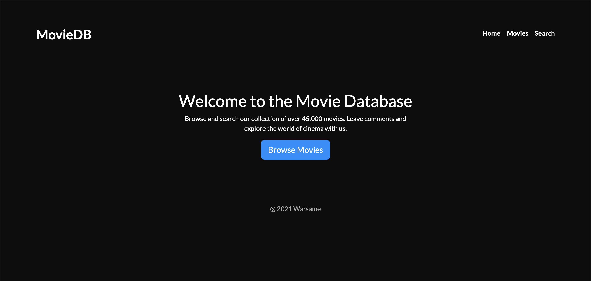
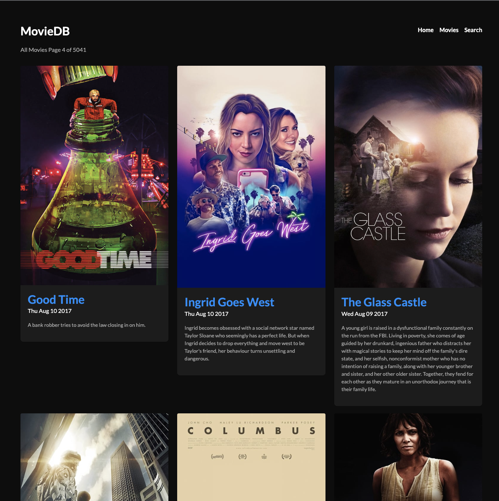
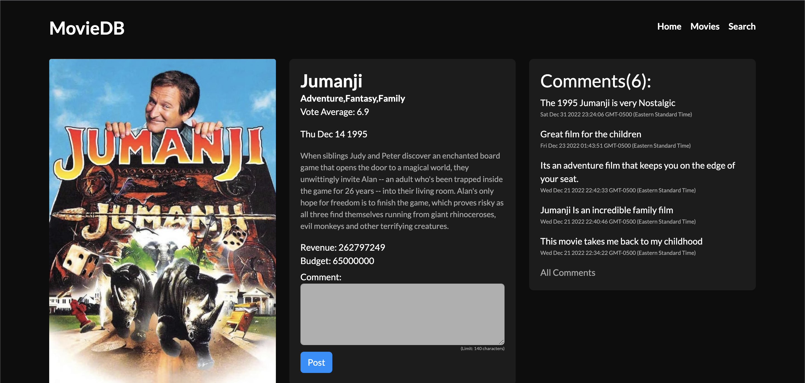
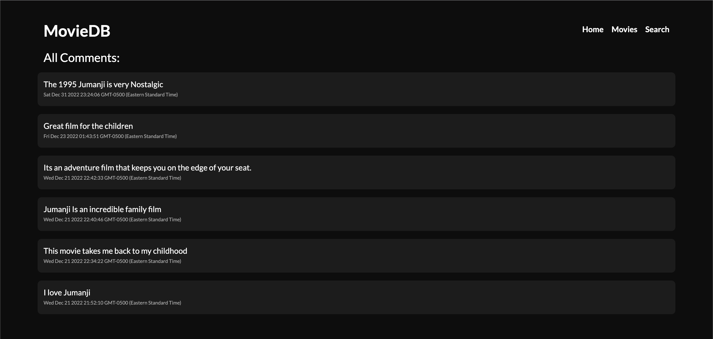
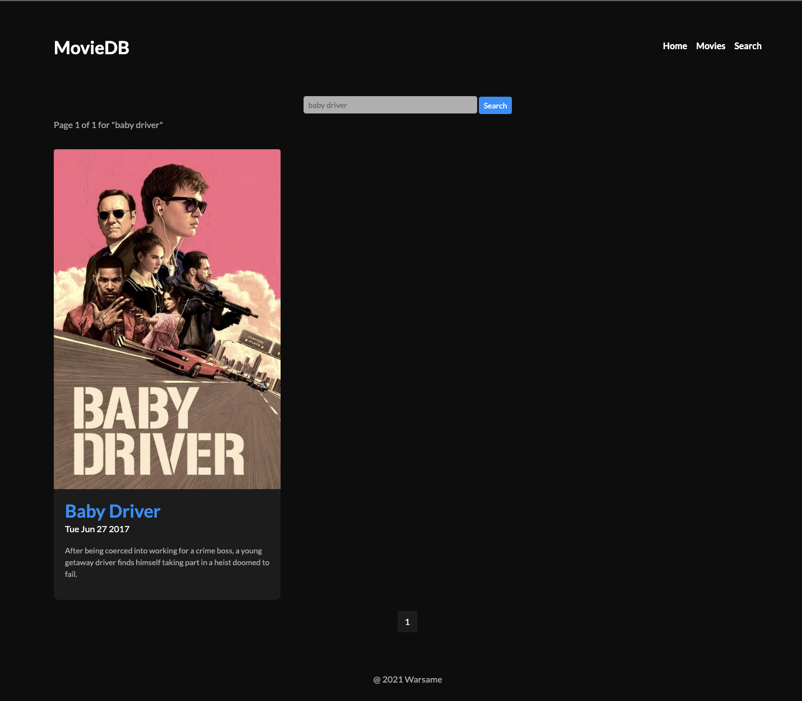

## Code Previews and Descriptions

1. Cover

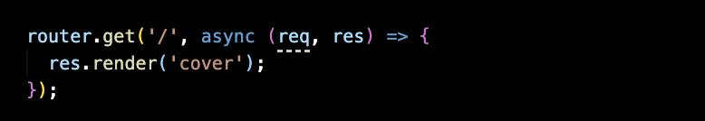

      This code defines a route for an HTTP GET request to the root path ('/') of an application. When a client sends an HTTP GET request to the root path, the server renders the cover template and sends the resulting HTML as a response to the client. The req and res objects represent the incoming request and the server's response, respectively.

2. Movies

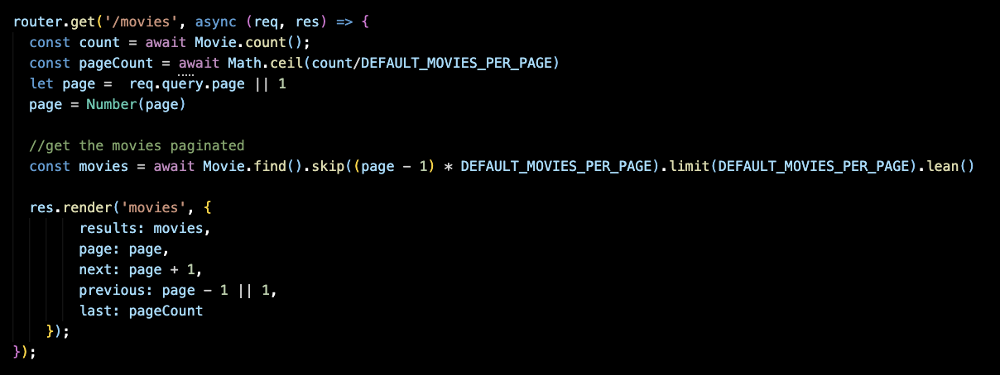

      In this code, the router.get method is defining a route for an HTTP GET request to the '/movies' path. When a client sends an HTTP GET request to the '/movies' path, the callback function defined in the router.get method will be executed.
      The callback function has two arguments: req and res. req (short for request) is an object that represents the incoming HTTP request, and res (short for response) is an object that represents the server's response to the request.
      Inside the callback function, the code first calculates the total number of movies in the database using the Movie.count() method. It then calculates the total number of pages needed to display all the movies using the DEFAULT_MOVIES_PER_PAGE constant.
      The code then retrieves the page number from the page query parameter in the request, or defaults to page 1 if the page parameter is not provided. The page number is then converted to a number using the Number() function.
      Next, the code uses the Movie.find() method to retrieve a paginated list of movies from the database. The skip() and limit() methods are used to paginate the results. The lean() method is used to convert the movies to a plain JavaScript object.
      Finally, the code renders the movies template and sends the resulting HTML as a response to the client. The results, page, next, previous, and last variables are passed to the template as template variables.

3. Movie info route

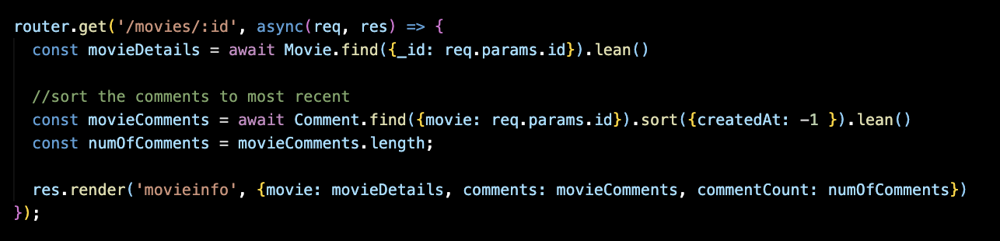

      In this code, the router.get method is defining a route for an HTTP GET request to a path with a :id parameter. When a client sends an HTTP GET request to this path with a specific id value, the callback function defined in the router.get method will be executed.
      Inside the callback function, the code first retrieves movie details from the database using the Movie.find() method and the id value provided in the request. The lean() method is used to convert the movie details to a plain JavaScript object.
      Next, the code retrieves a list of comments for the movie using the Comment.find() method and the id value provided in the request. The sort() method is used to sort the comments by the createdAt field in descending order. The lean() method is used to convert the comments to a plain JavaScript object. The code then calculates the number of comments using the length property of the movieComments array.
      Finally, the code renders the movieinfo template and sends the resulting HTML as a response to the client. The movie and comments variables are passed to the template as template variables, along with the commentCount variable.

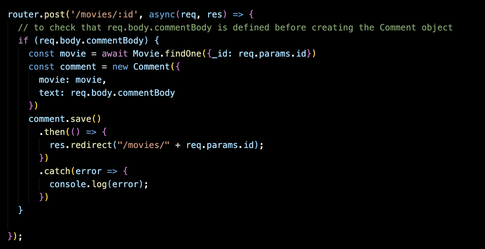

      This code defines a route for an HTTP POST request to the '/movies/:id' path of an application. When a client sends an HTTP POST request to this path with a specific id value, the callback function defined in the router.post method will be executed.
      Inside the callback function, the code first checks if the req.body.commentBody property is defined. If it is defined, the code retrieves the movie with the id value provided in the request using the Movie.findOne() method. It then creates a new Comment object with the movie and text properties set to the retrieved movie and the req.body.commentBody value, respectively.
      The code then saves the Comment object to the database using the save() method. If the save is successful, the code redirects the client to the '/movies/:id' path with the same id value using the res.redirect() method. If there is an error, the error is logged to the console using the console.log() method.

4. Comments route

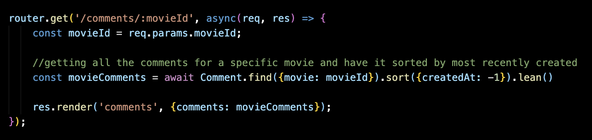

      This code defines a route for an HTTP GET request to the '/comments/:movieId' path of an application. When a client sends an HTTP GET request to this path with a specific movieId value, the callback function defined in the router.get method will be executed.
      Inside the callback function, the code retrieves the movieId value from the req.params object. It then uses the Comment.find() method to retrieve all the comments for the movie with the specified movieId value from the database. The sort() method is used to sort the comments by the createdAt field in descending order. The lean() method is used to convert the comments to a plain JavaScript object.
      Finally, the code renders the comments template and sends the resulting HTML as a response to the client. The comments variable is passed to the template as a template variable.

5. Search route

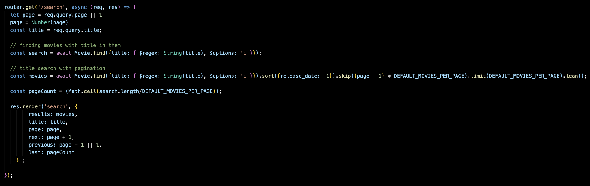

      This code defines a route for an HTTP GET request to the '/search' path of an application. When a client sends an HTTP GET request to this path with a title query parameter, the callback function defined in the router.get method will be executed.
      Inside the callback function, the code retrieves the title value from the req.query object and the page value from the req.query object or defaults to page 1 if the page parameter is not provided. The page number is then converted to a number using the Number() function.
      The code then uses the Movie.find() method to retrieve a list of movies from the database that have the specified title value in their title field. The $regex operator is used to match the title value with the title field in a case-insensitive manner.
      The code then retrieves a paginated list of movies from the database using the same Movie.find() method and the same search criteria as before. The sort() method is used to sort the movies by the release_date field in descending order, and the skip() and limit() methods are used to paginate the results. The lean() method is used to convert the movies to a plain JavaScript object.
      The code then calculates the total number of pages needed to display all the movies using the search.length value and the DEFAULT_MOVIES_PER_PAGE constant.
      Finally, the code renders the search template and sends the resulting HTML as a response to the client. The results, title, page, next, previous, and last variables are passed to the template as template variables.

## Installation and Setup Instructions

To install the dependencies:

```sh
npm install
```

To run the code:

```sh
Node app.js
```

To Visit App:

`localhost:3000`

## Reflection

This code was once an assignment for my client-server systems class in university, the assignment was created for me to learn how to use MongoDB and Mongoose while creating REST API endpoints using Express. We would use a dataset that the professor found on Kaggle and we were assigned to create endpoints that will allow us to retrieve, add, update, and delete data from the dataset.

Originally the project was all backend and had no front-end, I decided to use my knowledge with bootstrap to create an attractive frontend that is inviting and interactive. I also set out to create a my own endpoints such as ‘/search’ that would sort searched movie titles from most recently released.

The thing that made this project challenging was using handlebars/mustache, I was already use to EJS, but I wanted to try something new and I was recommended. What made Handlebars challenging was learning how to create helpers/functions that would assist me in the templating process, not knowing that helper can be created in different ways is what had me scratching my head, but with persistence a solution was found.

The technologies implemented in this project were HTML, CSS, Bootstrap, HandleBars, NodeJS, ExpressJS, Mongoose and MongoDB.
